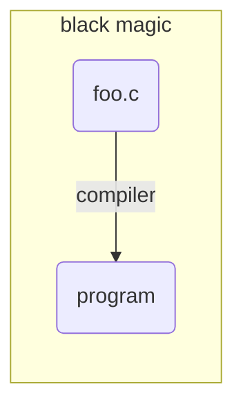
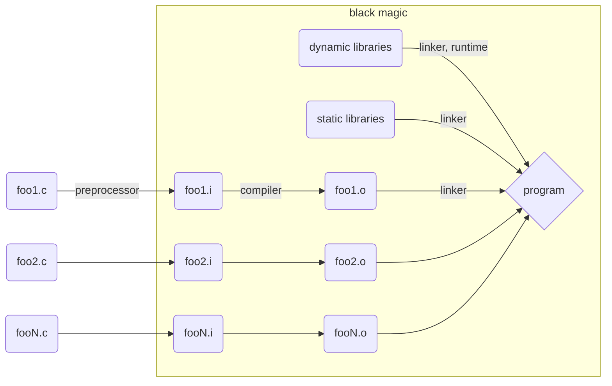
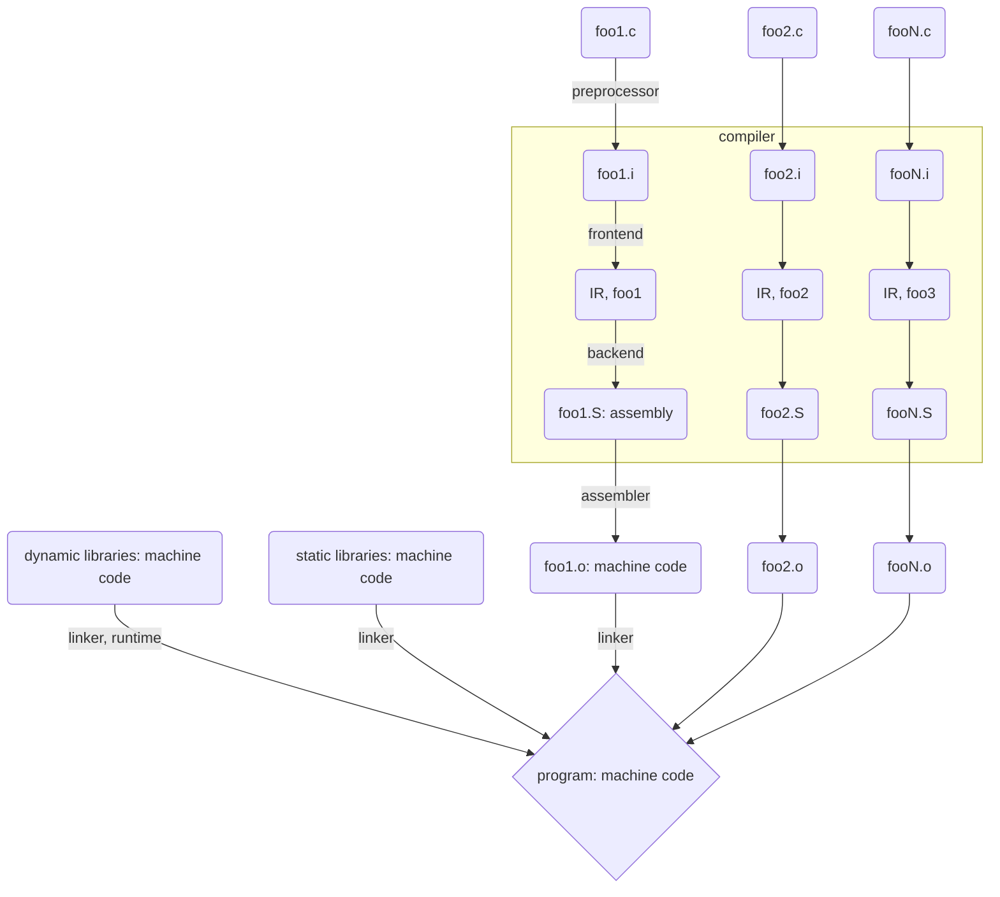

### What is this?

An introduction to x86 64-bit assembly, with thoroughly commented code.

### Why?

Because most entry-level assembly code is 32-bit, yet most processors nowadays are 64-bit.
Also, information about assembly in general seems scarce.

### But why learn assembly?

When I started learning C, I had a mental diagram that went



As I learned, this diagram was updated until it became something like this:



There's still an awful lot of black magic in that. (The preprocessor was the only thing I actually understood,
because it's just text substitution.)  
It felt like the Wise Ones, from the top of Mount Turing, had granted us,
lowly apprentices, the all-mighty Compiler, so we could play around with our silly programming languages
and pretend we're like Them...  
"How can I call myself a programmer if I don't understand the tool I use most often?" I wondered.
So I decided to study how the compiler works, and that's what led me to assembly.

There are plenty of other reasons to learn it, though. You'll need to know assembly to:

- Deal with executables directly, which may be needed if you don't have the source code:
	- Binary patches, i.e. changing the program directly
	- Reverse engineering, i.e. retrieving source code from an exectuable
	- Malware analysis, i.e. deciding whether a program is malware or not

- Implement some performance-critical systems, which use assembly to squeeze every bit (pun intended) of performance
out of the CPU

- Believe it or not, debugging. In some cases where you don't have a clue why your program is behaving the way it is,
looking at the assembly code generated can tell what the program is actually doing.

### What is assembly?

Your CPU doesn't understand C, Python, Javascript, or whatever programming language you're used to.
What *does* it understand, then? There must be some set of basic operations which are understood directly
by the processor, and which are Turing complete, otherwise Turing complete languages wouldn't be able to run on it.  
Indeed, those basic operations are called *instructions*, and they're encoded by a bunch of bytes meant to be
fed directly to the processor. For instance:

```
	48 89 c8
```

What instruction is that? You don't know? Neither do I. Obviously, looking at the bytes
of instructions directly isn't very effective unless you memorize which instruction corresponds
to which bytes.  
Now, if I tell you that instruction is

```
	mov rax, rcx
```

Much better, isn't it? You may not know yet what this means, but at least you can read it.  
The previous raw bytes are in a way the processor would understand directly, so we say
it's written in a machine language. As for the human-readable form, it's in an **assembly language**.  
To use assembly languages, *assemblers* have been created: programs that convert
assembly code to machine code.

Naturally, machine language may vary from one processor to another.
Any CPU belongs to a certain *architecture*, which defines, among other things,
the *instruction set* that CPU understands.  
Therefore, asssembly isn't a single programming language, but a family of languages,
each of which gives human-readable form to the machine code understood by a certain
CPU architecture.

Here, we'll show assembly code for the x86 architecture, to which most computers'
CPUs belong (as opposed to mobile devices, whose processors are generally ARM).
Specifically, the assembly code shown here is for the 64-bit version of the
x86 archictecture, which is generally called x86-64, x64, or amd64.
(That last name is used for Intel processors as well as AMD ones.)

Assembly languages are often called *low-level* languages, because they deal very
closely with hardware. In contrast, all other programming languages are called
*high-level* languages. (Some people say C is a low-level language, because it's
much closer to the hardware than languages like Python, but throwing C in the same
basket as assembly isn't right either. Perhaps we should compromise and call C
a middle-level language?)

Assembly has significant short-comings, though, and that's what ultimately led to
the creation of high-level languages. Namely, assmebly

- isn't portable: code written for one processor won't necessarily work on a different one.
Nowadays this may not be so much of an issue, since there's only half a dozen
prevailing CPU architectures now, but back when the first high-level languages were created,
this was a serious issue. Also, assembly code depends on which assembler you use, because
each have their own syntax and directives; this is unlike writing C code, because C always
has the same syntax regardless of which compiler will be used.
(Assembly code also depends on the operating system, but so does most high-level code anyway.)

- is hard to read and mantain: ever heard of spaghetti code? In assembly that's the only way of
doing anything. There's no `if` or `while` or anything of that sort.
Even Dijkstra's famous paper "Go To Statement Considered Harmful" has a remark in that sense:

> [...] and I became convinced that the **go to** statement should be abolished from all
> higher level" programming languages (i.e. everything except, perhaps, plain machine code)

Not only that, but assembly allows doing computations in bizarre ways, which might as well be faster
to execute, but are much slower to understand.

- is easy to make mistakes in: the closer you get to the hardware, the more annoying details
you'll forget to put in your code there are. Also, since assembly is even closer to the hardware
than C, you'll get all the segmentation faults you'd get there, plus a few more (no, really).
So if you're used to Java levels of hand-holding, I warn you beforehand: this will be a royal pain.

- lacks abstractions that make coding easier. Classes, closures, smart pointers / garbage collection,
you name it... none of this exists here.

It should be noted, however, that all this high-level code has to become machine code at some point
so it can be executed: usually, this is done translating that code to assembly first
(after which the assembler takes over).  
And who does that? The all-mighty Compiler, granted to us by the Wise Ones... not for us, but for themselves,
because they were fed up with assembly!

### Full compilation diagram
After learning all that, my mental compilation diagram was finally updated to this:



Note how the compiler is split into frontend and backend: compilers usually support writing
machine code to more than one CPU architecture, so rather than converting the high-level code
to that directly, it first converts it into some form of architecture-independent
intermediate representation (IR).

Also, it may seem weird that the linker recieves and produces machine code. Indeed, the linker
doesn't translate the code, it just takes the symbols (functions, global variables, etc)
referenced (but not defined) in some file and ties them to their definition in some other file.
If the input files are being linked against some dynamic library, the linker is called again at runtime.

### System Requirements

Assembly isn't portable at all. Therefore, the code here will only run in Linux,
in a CPU with the x86-64 architecture. If you don't know yours, run
```bash
	$ uname -m
```
To assemble the code, you'll need `nasm` (Netwide Assembler), version 2.12 or greater.
To link it, any linker will do. (ld and gold come with binutils, so chances are you have them already).

For assembly code that uses C library functions, you'll need an implementation
of the C library; glibc will do (once again, you probably have it).
gcc isn't strictly needed, but it makes it easier to link such code.

### Assembling and linking

Assembling with `nasm`:

```bash
	$ nasm -g -f elf64 foo.asm
```

The -g switch is to produce debugging information, for e.g. `gdb`, and it's optional.
The -f switch specifies the format (in this case, the 64-bit Executable and Linking Format (ELF)).  
If everything goes well, you should get a foo.o file.

Linking:
```bash
	$ ld -o foo foo.o		# default
	$ gcc -o [-no-pie] foo foo.o -v	# if your file contains C function calls
```

The -o switch (in both lines) specifies the executable's name;
if omitted, it will be named a.out.
The -v switch (in the 2nd line) is optional, and increases verbosity, in case you want to see
what `gcc` is doing under the hood.
You may need the -no-pie option when linking with `gcc` if your code is using absolute addresses.  
If, upon trying to execute the executable, you get  
```
	bash: ./foo: No such file or directory
```
It means something went wrong when linking, but you've got an useless file nonetheless. Sweet.

### Debugging

Debugging programs generated by assemblers might seem, in principle, the same as with any other program.
However, debuggers are usually tied to the high-level code that generated that program
(stepping through line numbers in that code, keeping track of variables, etc). Here, we normally want
to step through instructions rather than source code lines, and to see the registers' and memory's
contents instead of variables.  
I don't know whether the debugger of your favourite IDE (if you have one) has such features:
feel free to check that. What I do know is the GNU Debugger (`gdb`) has them:

| option                           | description |
|:--------------------------------:|:------------------------------------------:|
| `disas[semble]`                  | print the instructions of a function. |
| `set disassembly-flavor intel`   | so that the output of `disas` will be in intel syntax, as opposed to AT&T (which is `gdb`'s default) |
| `si`, `ni`                       | analogous to `s` and `n` execept they step through instructions rather than source code lines |
| `info reg` `[reg1]` `[reg2]` ... | prints the value of the requested registers. (Omitting that argument will print all registers) |
| `print $<reg>`                   | another way of printing a single register's value. The `$` is required. |
| `x/<fmt>`                        | examine the contents of a memory location. |
| `info stack`                     | print the stack. |

Also, there are a few debugging tools out there that you probably didn't need with high-level languages,
but which are of great use in assembly:

- `strace`: prints your program's system calls. This can be used to quickly find errors in system calls.
- `ltrace`: prints your program's library calls. Same idea.

And as usual, `valgrind` is wonderful for finding memory-related errors.

### Intel vs AT&T syntax

In x86 assembly, there are two "flavors" of syntax: Intel and AT&T.
`nasm` uses Intel syntax, while the GNU assmebler (`as`) uses AT&T syntax
by default (though it has support for Intel syntax as well).
All source files presented here were written for `nasm` and therefore use the
Intel syntax.

The file `att.md` summarizes the differences between the two flavors.

### References

There are several seemingly vague references in the code, such as 'ABI',
'instruction set', etc. Here are the documents I'm citing:

| Reference                  | Document
|:--------------------------:|-----------------------------------------------|
| ABI                        |  System V Application Binary Interface, AMD64 Architecture Processor Supplement, Draft Version 0.99.8 |
| Basic architecture         |  Intel(R) 64 and IA-32 Architectures Software Developer's Manual Volume 1: Basic Architecture |
| Instruction set            |  Intel(R) 64 and IA-32 Architectures Software Developer's Manual Volume 2 (2A, 2B & 2C): Instruction Set Reference, A-Z |
| NASM manual                | NASM - The Netwide Assembler, version 2.12.01 |
| System programming guide   |  Intel(R) 64 and IA-32 Architectures Software Developer's Manual Volume 3 (3A, 3B, 3C & 3D): System Programming Guide |

It's also noteworthy that the number corresponding to each system call can be found in
`/usr/include/asm/unistd_64.h`.

### External Links

[This image](https://commons.wikimedia.org/wiki/File:Table_of_x86_Registers_svg.svg)
shows all x86-64 registers.

### Copyright 

This file, as well as all other files in this project, are relased under the CC-BY-SA 2.0 license.
See the file called LICENSE for details.
